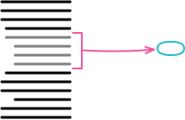
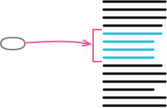
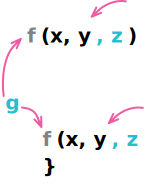
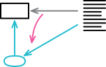
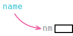
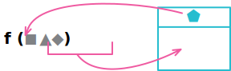
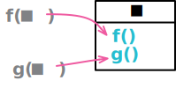
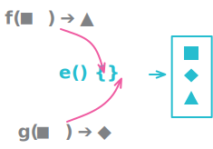
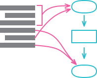

# 기본적인 리팩터링

## 6.1 함수 추출하기, Extract Function

### 배경
- 목적과 구현을 분리하는 것
- 나중에 코드를 읽더라고 함수의 목적이 눈에 확 들어오고 본문 코드에 대해서는 크게 신경쓰지 않기 위함이다.
- 이름 짓기에 특별히 신경을 써야한다

### 절차
1. 함수를 새로 만들고 목적을 잘 드러내는 이름을 붙인다. 함수의 이름가 무엇을 하는지 드러내야 한다.
2. 추출할 코드를 원본 함수에서 복사하여 새 함수에 붙여넣는다.
3. 추출한 코드 중 원본 함수의 지역 변수를 참조하거나 추출한 함수의 유효범위를 벗어나는 변수는 없는지 검사하고 있다면 매개변수로 전달한다.
   1. 추출한 코드에서만 사용하는 변수가 추출한 함수 밖에서 선언되면 추출한 함수 안에서 선언하도록 변경
   2. 만약 추출한 함수 내에서 값이 바뀌어 반환되는 변수가 하나인 경우 추출한 함수를 질의 함수로 취급해서 그 결과를 해당 변수에 대입한다.
   3. 만약 이런 변수가 너무 많은 경우 함수 추출을 멈추고 변수 쪼개기 혹은 임시 변수를 질의 함수로 바꾸기 같은 다른 리팩터링을 사용해 단순화 시킨 뒤 다시 함수 추출을 시도한다.
4. 변수를 다 처리한 뒤 컴파일한다.
5. 원본 함수에서 추출한 코드 부분을 새로 만든 함수를 호출하는 문장으로 바꾸면서 추출한 함수로 역할을 위임한다.
6. 테스트
7. 다른 코드들 중에 추출한 함수와 비슷한 코드가 있는지 확인하고 있다면 새로운 함수로의 변환을 검토한다.
### 예시

## 6.2 함수 인라인하기, Inline Function

### 배경
- 때로는 함수 본문이 이름만큼 명확한 경우도 있다.
- 간접 호출이 편하지만 쓸데없는 간접 호출을 거슬린다.
- 정말 필요한 경우를 제외하고는 간접 호출을 줄이고 함수를 인라인 한다.
- 핵심은 항상 단계를 잘게 나눠서 처리한다는 것이다.
### 절차
1. 다형 메서드(polymorphic method)인지 확인한다.
   1. 서브 클래스에서 오버라이드 하는 메서드는 인라인을 하면 안된다.
2. 인라인할 함수를 호출하는 곳을 모두 찾는다.
3. 각 호출문을 함수 본문으로 교체한다.
4. 교체시마다 테스트
5. 원래 함수를 삭제한다.
### 예시

## 6.3 변수 추출하기, Extract Variable

### 배경
- 표현식이 너뭐 복잡해 이해하기 어려운 경우 지역 변수를 활용해 표현식을 쪼개면 관리하기가 더 쉬워진다.
### 절차
1. 추출하려는 표현식에 부작용은 없는지 확인하다.
2. 불변 변수를 하나 선언하고 이름을 붙일 표현식의 복제본을 대입한다.
3. 테스트한다.
4. 표현식을 여러 곳에서 사용한다면 각각을 새로 만든 변수로 교체하고 교체할때마다 테스트한다.
### 예시

## 6.4 변수 인라인하기, Inline Variable

### 배경
- 변수의 이름이 원해 표현식과 다를 바 없거나 변수가 주변 코드를 리팩터링 하는 데 방해가 된다면 해다 변수를 인라인 한다.
### 절차
1. 대입문의 표현식에서 부작용이 생기지는 않는지 확인한다.
2. 변수가 불변으로 선언되지 않았다면 불변으로 만들어 테스트한다.
   1. 변수에 값이 한 번만 대입되는지 확인을 하기 위함
3. 이 변수를 가장 처음 사용하는 코드를 찾아서 대입문 우변의 코드로 바꾼다.
4. 테스트
5. 변수를 사용하는 부분을 모두 교체할 때까지 과정을 반복한다.
6. 변수 선언문과 대입문을 지운다
7. 테스트
### 예시

## 6.5 함수 선언 바꾸기, Change Function Declaration

### 배경
- 좋은 이름의 함수는 구현 코드를 살펴볼 필요 없이 호출문만 보고도 무슨 일을 하는지 파악할 수 있다.
- 매개변수는 함수가 외부 세계와 어우러지는 방식을 정의하며 적절한 매개변수의 정의는 활용 범위가 넓어지며 다른 모듈과의 결합을 제거할 수도 있다.
### 절차
#### 간단한 절차
1. 매개변수를 제거하려거든 먼저 함수 본문에서 제거 대상 매개변수를 참조하는 곳은 없는지 확인한다.
2. 먀소드 선언을 원하는 형태로 바꾼다.
3. 기존 메서드 선언을 참조하는 부분을 모두 찾아서 바뀐 형태로 수정한다.
4. 테스트
#### 마이그레이션 절차
1. 이어지는 추출 단계를 수월하게 만들어야 한다면 함수의 본문을 적절히 리팩터링한다.
2. 함수 본문을 새로운 함수로 추출(6.1) 한다.
3. 추출한 함수에 매개변수를 추가해야 한다면 '간단한 절차'를 따라 추가한다.
4. 테스트
5. 기존 함수를 인라인(6.2)한다.
6. 이름을 임시로 붙여뒀다면 함수 선언 바꾸기를 한 번 더 적영해 원래 이름으로 되돌린다.
7. 테스트
### 예시

## 6.6 변수 캡슐화하기, Encapsulate Variable

### 배경
- 데이터가 함수보다 다루기 까다로운 이유는
  - 함수의 이름을 바꾸거나 다른 모듈로 옮기기는 어렵지 않지만(기존 함수를 그대로 두고 전달 함수로 활용할 수도 있기 때문), 데이터를 이런 식으로 처리할 수 없기 때문이다.
  - 데이터는 참조하는 모든 부분을 한 번에 바꿔야 코드가 잘 작동한다.
  - 데이터의 유효 범위가 넓어질수록 다루기가 어려워지며 전역 데이터가 다루기 힘든 이유이기도 하다.
- 젋근 범위가 넓은 데이터를 옮길 때는 먼저 해당 데이터로의 접근을 독점하는 함수를 만드는 식으로 캡슐화하는 것이 가장 좋은 방법일 떄가 많다.
- 데이터 재구성이 아닌 함수 재구성으로 단순하게 작업을 하는 것.
- 데이터 캡슐화는 데이터를 변경하고 사용하는 코드를 확실하게 감시 할 수 있기에 데이터 변경 전 검증이나 변경 후 추가 로직을 쉽게 끼워 넣을 수 있다.
- 유효 범위가 함수 하나보다 넓은 가변 데이터는 캡슐화 하여 함수를 통해서만 접근하게 만든다.
- 객체지향에서 객체의 데이터를 항상 private으로 유지해야 한다고 강조하는 이유도 마찬가지다.
- 다만 불변 데이터는 가변 데이터보다 캡슐화 할 이유가 적다.
  - 변경 될 일이 적고 추가 로직이 자리할 공간이 필요가 없으며 필요하다면 그냥 값을 복제하면 된다.
### 절차
1. 변수로의 접근과 갱신을 전담하는 캡슐화 함수들을 만든다.
2. 정적 검사를 수행한다.
3. 변수를 직접 참조하던 부분을 모두 적절한 캡슐화 함수 호출로 바꾼다. 하나씩 바꿀 떄마다 테스트
4. 변수의 접근 범위를 제한
5. 테스트
6. 변수 값이 레코드라면 레코드 캡슐화하기를 고려한다.
### 예시

## 6.7 변수 이름 바꾸기, Rename Variable

### 배경
- 명확한 프로그래밍의 핵심은 이름짓기다
### 절차
1. 폭넓게 쓰이는 변수라면 변수 캡슐화하기를 고려한다.
2. 이름을 바꿀 변수를 참조하는 곳을 찾아서 변경하고 바꿀 때마다 테스트
3. 테스트
### 예시

## 6.8 매개변수 객체 만들기, Introduce Parameter Object

### 배경
- 데이터 항목 여러개가 항상 이 함수 저 함수로 함께 몰려다니는 경우 데이터 구조 하나로 모아준다.
- 데이터 사이의 관계가 명확해지고 매개변수 수가 줄어들며 같은 데이터 구조를 사용하는 모든 함수가 원소를 참조할 떄 항상 똑같은 이름을 사용하기 때문에 일관성도 높아진다.
### 절차
1. 적당한 데이터 구조가 아직 마련되어 있지 않다면 새로 만든다.
2. 테스트
3. 함수 선언 바꾸기(6.5)로 새 데이터 구조를 매개변수로 추가한다.
4. 테스트
5. 함수 호출 시 새로운 데이터 구조 인스턴스를 넘기도록 수정한다. 하나씩 수정할 때마다 테스트한다.
6. 기존 매개변수를 사용하던 코드를 새 데이터 구조의 원소를 사용하도록 바꾼다.
7. 기존 매개변수를 제거하고 테스트한다.
### 예시
- [equaility method](https://www.artima.com/articles/how-to-write-an-equality-method-in-java#:~:text=The%20contract%20of%20the%20equals,values%20x%20and%20y%20%2C%20x.)

## 6.9 여러 함수를 클래스로 묶기, Combine Functions into Class

### 배경
- 공통 데이터를 중심으로 긴밀하게 엮여 작동하는 함수 무리를 클래스 하나로 묶으면, 이 함수들이 공유하는 공통 환경을 더 명확하게 표현할 수 있고 각 함수에 전달되는 인수를 줄여서 객체 안에서의 함수 호출을 간결하게 만들 수 있다.
- 또한 이런 객체를 시스템의 다른 부분에 전달하기 위한 참조를 제공할 수 있다.
### 절차
1. 함수들이 공유하는 공통 데이터 레코드를 캡슣롸(7.1)한다.
   1. 공통 데이터가 레코드 구조로 묶여 있지 않다면 먼저 매개변수 객체 만들기(6.8)로 데이터를 하나로 묶는 레코드를 만든다.
2. 공통 레코드를 사용하는 함수 각각을 새 클래스로 옮긴다.(함수 옮기기 8.1)
   1. 공통 레코드의 멤버는 함수 호출문의 인수 목록에서 제거
3. 데이터를 조작하는 로직들은 함수로 추출(6.1)해서 새 클래스로 옮긴다.
### 예시

## 6.10 여러 함수를 변환 함수로 묶기, Combine Functions into Transform

### 배경
- 데이터를 입력 받아 여러 정보를 도출하고 이 정보는 여러 곳에서 사용된다. 이 정보가 사용되는 곳마다 같은 도출 로직이 반복되는데 이들을 모아두면 검색과 갱신을 일관된 장소에서 처리할 수 있고 로직의 중복을 막을 수 있다.
- 변환 함수는 원본 데이터를 입력받아서 필요한 정보를 모두 도출한 뒤 ,각각을 출력 데이터의 필드에 넣어 반환한다.
- 혹은 여러 함수를 클래스로 묶기(6.9)로 처리해도 된다.
### 절차
1. 변환할 레코드를 입력받아서 값을 그대로 반환하는 변환 함수를 만든다.
   1. 이 작업은 대체로 깊은 복사로 처리해야 한다. 변환 함수가 원본 레코드를 바꾸지 않응지 검사하는 테스트를 마련하자.
2. 묶을 함수 중 함수 하나를 골라서 본문 코드를 변환 함수로 옮기고, 처리 결과를 레코드에 새 필드로 기록한다. 그리고 클라이언트 코드가 이 필드를 사용하도록 수정한다.
   1. 만약 로직이 복잡하면, 함수 추출하기(6.1)부터 시작한다.
3. 테스트
4. 나머지 관련 함수도 위 과정에 따라 처리한다.
### 예시

## 6.11 단계 쪼개기, Split Phase

### 배경
- 서로 다른 두 대상을 한꺼번에 다루는 코드는 별개 모듈로 나눈다.
- 코드 수정시 하나에만 집중할 수 있다.
- 잘 분리된 모듈은 다른 모듈의 상세 내용은 전혀 기억하지 못해도 원하는 대로 수정을 마칠 수 있다.
### 절차
1. 두 번쨰 단뎨에 해당하는 코드를 독립 함수로 추출한다.
2. 테스트
3. 중간 데이터 구조를 만들어서 앞에서 추출한 함수의 인수로 추가한다.
4. 테스트
5. 추출한 두 번쨰 단계 함수의 매개변수를 하나씩 검토한다. 그중 첫 번쨰 단계에서 사용되는 것은 중간 데이터 구조로 옮긴다. 하나씩 옮길 때마다 테스트한다.
   1. 간혹 두 번째 단계에서 사용하면 안 되는 매개변수가 있는데 이런 경우 각 매개변수를 사용한 결과를 중간 데이터 구조의 필드로 추출하고, 이 필드의 값을 설정하는 문장을 호출한 곳으로 옮긴다.(8.4)
6. 첫 번쨰 단계 코드를 함수로 추출(6.1)하면서 중간 데이터 구조를 반환하도록 만든다.
   1. 이때 첫번째 단계를 변환기 객체로 추출해도 된다.
### 예시