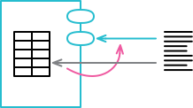
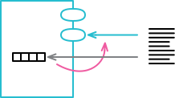
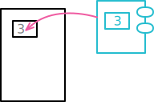
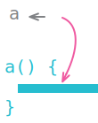
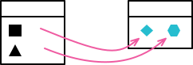
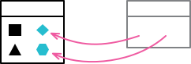
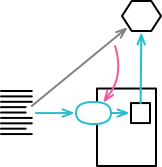
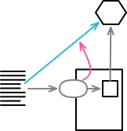
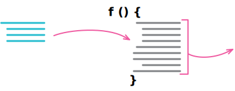

# 캡슐화

## 7.1 레코드 캡슐화하기, Encapsulate Record

### 배경
- 
### 절차
### 예시

## 7.2 컬렉션 캡슐화하기, Encapsulate Collection

### 배경
- 
### 절차
### 예시

## 7.3 기본형을 객체로 바꾸기, Replace Primitive with Object

### 배경
- 
### 절차
### 예시

## 7.4 임시 변수를 질의 함수로 바꾸기, Replave Temp with Query

### 배경
- 
### 절차
### 예시

## 7.5 클래스 추출하기, Extract Class

### 배경
- 
### 절차
### 예시

## 7.6 클래스 인라인하기, Inline Class

### 배경
- 
### 절차
### 예시

## 7.7 위임 숨기기, Hide Delegate

### 배경
- 
### 절차
### 예시

## 7.8 중개자 제거하기, Remove Middle Man

### 배경
- 
### 절차
### 예시

## 7.9 알고리즘 교체하기, Substitute Algorithm

### 배경
- 
### 절차
### 예시
